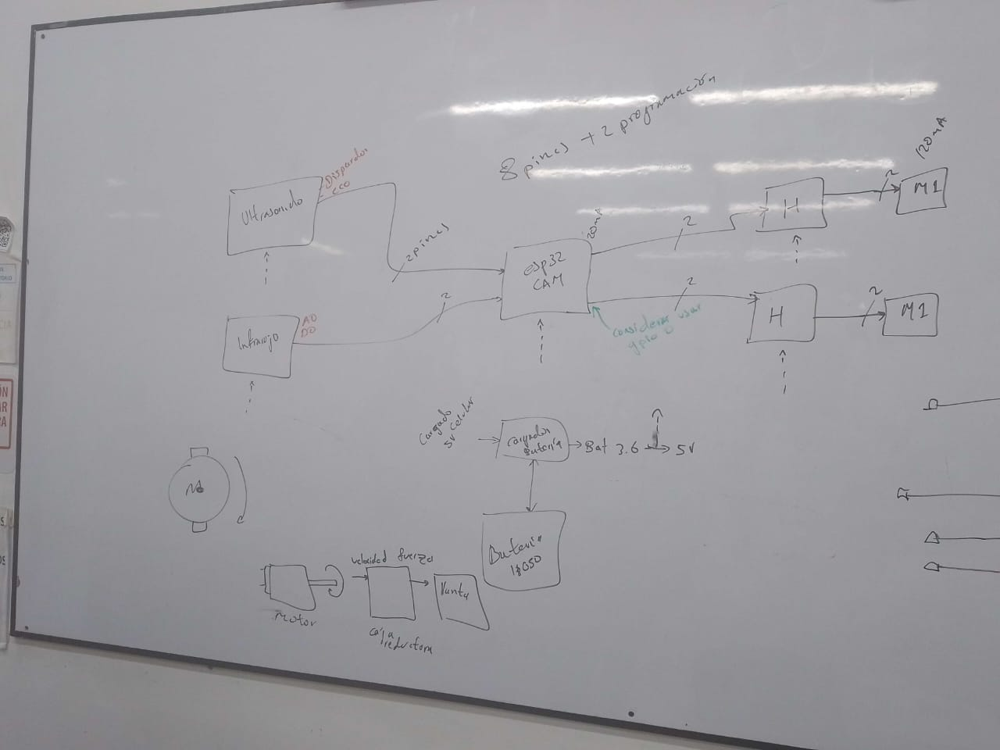

# Explorer-Bot

- Johan Arturo Barajas Herrera
- Jose Alejandro Flores Chenas
- Daniel Santiago Puentes Villabona

## DESCRIPCIÓN
Este proyecto consiste en el diseño y desarrollo de un carrito controlado de forma remota mediante WiFi utilizando el módulo ESP32. El carrito ofrece movilidad ágil y emite una red WiFi, lo que permite su control desde cualquier dispositivo dentro del alcance de la red.

## IDEA INICIAL
La idea original era controlar el carrito utilizando un seguidor de linea,para explorar cuevas, se optó por un control remoto a través de WiFi. Además, se consideró utilizar una ESP32 CAM, pero debido a problemas técnicos se decidió utilizar una ESP32 estándar.

##  INTRODUCCIÓN
Este proyecto se centra en la creación de un carrito inteligente controlado por WiFi a través de un ESP32. El carrito se conecta a una red WiFi y se puede controlar desde cualquier lugar dentro del alcance de la red. El control se realiza a través de una interfaz en un dispositivo móvil o computadora, permitiendo enviar comandos para avanzar, retroceder, girar y detenerse. Este proyecto brinda la oportunidad de aprender sobre programación, electrónica y comunicación inalámbrica en un entorno práctico y educativo.

## DIAGRAMA DE FLUJO
Aqui se puede apreciar el funcionamineto del proyecto de inicio a fin con sus respectivas entradas y salidas, pero sin tener aun tener definidos los diferentes componentes y tecnlogias que podrian usarse para el desarrollo del carrito explorador

## CAJA NEGRA
Tenido en cuenta las diferentes recomendaciones de nuestro docente, se investigo y analizo los diferentes componentes y tecnlogias que pueden usarse para poder darle funcionamineto al carrito explorador.
La siguiente imagen plasma los componentes y tecnologia que se elegio:

## TRABAJO EN CLASE
Durante el desarrolo del proyecto, nuestro docente nos apoyaba dandonos varias recomendaciones y correciones, sin dejar de lado las recomendaciones para que podamos desarrollar y sacar adelante nuestro proyecto. 
A continuación se aprecia varias de las correcciones, retroalimentaciones y correciones recibidas en por parte de nuestro docente en horas de clase y a lo largo de todo el semestre en que se desarrollo el proyecto.

## MOTIVACIÓN
La motivación principal de este proyecto es adquirir conocimientos en electrónica. El desarrollo de un carrito controlado por WiFi con ESP32 nos permite sumergirnos en los fundamentos de la electrónica y obtener experiencia práctica en este campo. A través de este proyecto, se espera explorar conceptos y componentes electrónicos, así como mejorar habilidades de diseño y resolución de problemas en el ámbito de la electrónica. Esta experiencia de aprendizaje no solo es valiosa para este proyecto en particular, sino también para futuros proyectos y el crecimiento de habilidades en electrónica.

## GUÍA DE USO
Para utilizar el carrito, es necesario conectar un dispositivo (teléfono, computadora, etc.) a la red WiFi que emite el ESP32, llamada mired. Luego, se ingresa la contraseña, que en este caso es 8765432. A través de una aplicación de terminal o un navegador web, se accede a la dirección IP asignada al ESP32 (192.168.4.1). Desde la interfaz de control de app inventor, se pueden enviar comandos para controlar el movimiento del carrito, como avanzar, retroceder, girar y detenerse. Se puede experimentar con diferentes comandos y ajustar la velocidad según sea necesario.

## LISTA DE MATERIALES
El proyecto utiliza los siguientes componentes:

- L298D: Controlador de motor de puente H.
- ESP32: Módulo de desarrollo con conectividad WiFi.
- 2 motores DC: Proporcionan la tracción al carrito.
- Chasis: Estructura que sostiene y protege los componentes del carrito.
- 2 ruedas: Permiten el movimiento del carrito.
- Cables: Para realizar las conexiones entre los componentes.
- Pin headers o regleta de pines: Facilitan la conexión de los componentes al ESP32.

## OBJETIVOS DEL PROYECTO
Los objetivos principales de este proyecto son:

- Diseñar y desarrollar un carrito controlado por WiFi utilizando un ESP32.
- Construir un chasis que albergue los componentes del carrito.
- Conectar y configurar el ESP32 para establecer la conectividad WiFi y permitir controlar los diferentes componentes.

## IMPLEMENTACION
Luego de algunos inconvenientes y varias horas de trabajo, podemos apreciar el carrito explorador cerca de ser terminado.

